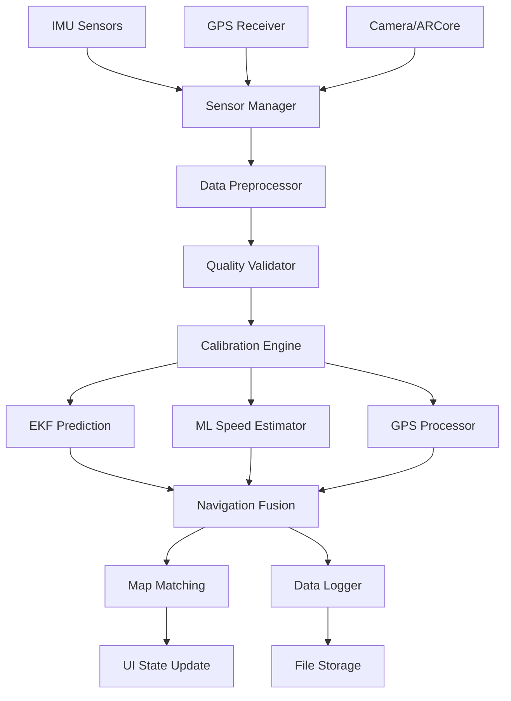

# NavAI System Architecture
## Comprehensive Technical Architecture Documentation

### 🏗️ High-Level System Overview

NavAI employs a sophisticated multi-tier architecture designed for real-time sensor fusion, machine learning inference, and robust navigation. The system is built with modularity, scalability, and performance as core principles.

```
┌─────────────────────────────────────────────────────────────────┐
│                        NavAI System Architecture                │
├─────────────────────────────────────────────────────────────────┤
│  📱 Presentation Layer (Android UI)                            │
│  ├── Jetpack Compose UI Components                             │
│  ├── Real-time Data Visualization                              │
│  ├── User Interaction Handlers                                 │
│  └── Navigation Status Dashboard                               │
├─────────────────────────────────────────────────────────────────┤
│  🧠 Application Logic Layer                                    │
│  ├── Navigation Service (Foreground Service)                   │
│  ├── Sensor Data Coordinator                                   │
│  ├── State Management (StateFlow/ViewModel)                    │
│  └── Configuration & Settings Manager                          │
├─────────────────────────────────────────────────────────────────┤
│  🔄 Sensor Fusion Engine                                       │
│  ├── Extended Kalman Filter (EKF)                              │
│  ├── ML Speed Estimator (TensorFlow Lite)                      │
│  ├── Navigation Fusion Controller                              │
│  └── Performance Monitoring                                    │
├─────────────────────────────────────────────────────────────────┤
│  📊 Data Processing Layer                                      │
│  ├── IMU Data Preprocessor                                     │
│  ├── GPS Data Handler                                          │
│  ├── Sensor Calibration Engine                                 │
│  └── Data Quality Validator                                    │
├─────────────────────────────────────────────────────────────────┤
│  🗺️ Map & Localization Layer                                   │
│  ├── MapLibre Offline Renderer                                 │
│  ├── Map Matching Algorithm                                    │
│  ├── Tile Cache Manager                                        │
│  └── Coordinate Transformation                                 │
├─────────────────────────────────────────────────────────────────┤
│  💾 Data Persistence Layer                                     │
│  ├── High-Frequency CSV Logger                                 │
│  ├── SQLite Configuration Database                             │
│  ├── File Rotation & Compression                               │
│  └── Export & Sharing Manager                                  │
├─────────────────────────────────────────────────────────────────┤
│  🔌 Hardware Abstraction Layer                                 │
│  ├── Android Sensor Manager Interface                          │
│  ├── Location Services Integration                             │
│  ├── ARCore VIO Interface (Optional)                           │
│  └── Device-Specific Optimizations                             │
└─────────────────────────────────────────────────────────────────┘
```

### 🧠 Core Components Deep Dive

#### **1. Extended Kalman Filter (EKF) Engine**

**Purpose**: Optimal fusion of multi-sensor data for state estimation

**State Vector (9 dimensions)**:
```
x = [px, py, vx, vy, yaw, bias_ax, bias_ay, bias_az, bias_gz]
```

**Mathematical Model**:
- **Prediction**: `x(k+1) = f(x(k), u(k)) + w(k)`
- **Update**: `x(k) = x(k-) + K(k)[z(k) - h(x(k-))]`
- **Covariance**: `P(k) = (I - K(k)H(k))P(k-)`

**Implementation Details**:
```kotlin
class EKFNavigationEngine {
    private var state: SimpleMatrix(9, 1)           // State vector
    private var covariance: SimpleMatrix(9, 9)      // Covariance matrix
    private var processNoise: SimpleMatrix(9, 9)    // Q matrix
    
    fun predict(imuData: IMUMeasurement)             // Prediction step
    fun updateWithSpeed(speedMeasurement)            // Speed update
    fun updateWithGPS(gpsMeasurement)                // GPS update
}
```

#### **2. Machine Learning Speed Estimator**

**Architecture**: 1D Convolutional Neural Network optimized for mobile inference

**Model Structure**:
```
Input: [batch, 150, 6] → Conv1D(32) → Conv1D(64) → Conv1D(128) 
     → GlobalAvgPool → Dense(64) → Dense(32) → Dense(1) → Output
```

**TensorFlow Lite Optimization**:
- **Quantization**: INT8 quantization for 4x size reduction
- **NNAPI Acceleration**: Hardware-specific optimization
- **Model Size**: <1MB for mobile deployment
- **Inference Time**: <10ms on modern Android devices

**Implementation**:
```kotlin
class MLSpeedEstimator {
    private var interpreter: Interpreter
    private val sensorWindow = ArrayBlockingQueue<IMUMeasurement>(150)
    
    fun addIMUMeasurement(measurement: IMUMeasurement)
    fun estimateSpeed(): SpeedMeasurement?
}
```

#### **3. Navigation Fusion Controller**

**Purpose**: Orchestrates the entire sensor fusion pipeline

**Data Flow**:
```
IMU Sensors (100Hz) → Preprocessing → EKF Prediction
                                   ↓
GPS Updates (5Hz) → Coordinate Transform → EKF Update
                                   ↓
ML Speed (4Hz) → Confidence Check → EKF Update
                                   ↓
Navigation State → Map Matching → UI Update
```

**Concurrency Model**:
```kotlin
class NavigationFusionEngine {
    private val scope = CoroutineScope(Dispatchers.Default)
    private val imuQueue = ConcurrentLinkedQueue<IMUMeasurement>()
    private val gpsQueue = ConcurrentLinkedQueue<GPSMeasurement>()
    
    // Real-time processing loop
    private suspend fun processSensorData() {
        while (isActive) {
            processIMUQueue()
            processGPSQueue()
            generateSpeedEstimate()
            delay(10) // 100Hz processing
        }
    }
}
```

### 📊 Data Flow Architecture

#### **Sensor Data Pipeline**



#### **Real-time Processing Flow**

**Thread Architecture**:
1. **Main Thread**: UI updates and user interaction
2. **Sensor Thread**: High-frequency sensor data collection
3. **Fusion Thread**: EKF processing and ML inference
4. **IO Thread**: File operations and data persistence
5. **Background Thread**: Map rendering and tile management

**Memory Management**:
- **Circular Buffers**: Fixed-size queues for sensor data
- **Object Pooling**: Reuse of measurement objects
- **Garbage Collection**: Minimal allocation in hot paths
- **Memory Mapping**: Efficient file I/O for large datasets

### 🗺️ Map Integration Architecture

#### **MapLibre Integration**

**Offline Map Stack**:
```
┌─────────────────────────────────────┐
│  MapLibre GL Native Renderer        │
├─────────────────────────────────────┤
│  Vector Tile Processing             │
├─────────────────────────────────────┤
│  MBTiles Offline Storage            │
├─────────────────────────────────────┤
│  Tile Cache Management              │
├─────────────────────────────────────┤
│  Network Tile Fetching (Optional)   │
└─────────────────────────────────────┘
```

**Map Matching Algorithm**:
```kotlin
class MapMatcher {
    fun snapToRoad(position: LatLon, heading: Double): MatchResult {
        val candidates = findNearbyRoads(position, searchRadius = 50.0)
        val scored = candidates.map { road ->
            val distanceScore = calculateDistanceScore(position, road)
            val headingScore = calculateHeadingScore(heading, road.bearing)
            val continuityScore = calculateContinuityScore(road, previousRoad)
            
            RoadCandidate(road, distanceScore + headingScore + continuityScore)
        }
        return scored.maxByOrNull { it.score }?.road
    }
}
```

### 🔄 State Management Architecture

#### **Reactive State Flow**

NavAI uses Kotlin's StateFlow for reactive state management:

```kotlin
// Navigation state flows
val navigationState: StateFlow<NavigationState>
val fusionStatus: StateFlow<FusionStatus>
val performanceMetrics: StateFlow<PerformanceMetrics>

// UI state composition
@Composable
fun NavigationScreen() {
    val navState by navigationState.collectAsState()
    val status by fusionStatus.collectAsState()
    val metrics by performanceMetrics.collectAsState()
    
    // UI updates automatically when state changes
}
```

#### **State Synchronization**

**Multi-threaded State Updates**:
- **Atomic Operations**: Thread-safe state updates
- **Event Ordering**: Timestamp-based event sequencing
- **Conflict Resolution**: Last-writer-wins with validation
- **State Persistence**: Automatic state saving and restoration

### 🔧 Configuration & Extensibility

#### **Modular Plugin Architecture**

```kotlin
interface NavigationPlugin {
    fun initialize(context: Context)
    fun processUpdate(state: NavigationState): NavigationState
    fun cleanup()
}

class PluginManager {
    private val plugins = mutableListOf<NavigationPlugin>()
    
    fun registerPlugin(plugin: NavigationPlugin)
    fun processAllPlugins(state: NavigationState): NavigationState
}
```

#### **Configuration System**

**Hierarchical Configuration**:
```yaml
navigation:
  ekf:
    process_noise:
      position: 0.1
      velocity: 0.5
      yaw: 0.01
    measurement_noise:
      speed: 1.0
      gps: 25.0
  
  ml:
    model_path: "speed_estimator.tflite"
    window_size_sec: 1.5
    confidence_threshold: 0.5
  
  sensors:
    sample_rate_hz: 100
    calibration_duration_sec: 30
    quality_threshold: 0.8
```

### 📈 Performance Monitoring Architecture

#### **Real-time Metrics Collection**

```kotlin
data class PerformanceMetrics(
    val processingRate: Double,        // Hz
    val memoryUsage: Long,             // Bytes
    val batteryDrain: Double,          // mA
    val accuracyMetrics: AccuracyStats,
    val latencyMetrics: LatencyStats
)

class MetricsCollector {
    fun collectSystemMetrics(): SystemMetrics
    fun collectNavigationMetrics(): NavigationMetrics
    fun generateReport(): PerformanceReport
}
```

#### **Adaptive Performance Tuning**

**Dynamic Optimization**:
- **Battery Level**: Reduce sampling rate when battery is low
- **Thermal State**: Throttle processing to prevent overheating
- **Memory Pressure**: Adjust buffer sizes and cache limits
- **Accuracy Requirements**: Trade-off between accuracy and performance

### 🔒 Security & Privacy Architecture

#### **Data Protection**

**Privacy-First Design**:
- **Local Processing**: All sensitive data processed on-device
- **Opt-in Telemetry**: User consent for any data sharing
- **Data Encryption**: AES-256 encryption for stored data
- **Secure Communication**: TLS 1.3 for any network operations

**Access Control**:
```kotlin
class SecurityManager {
    fun validatePermissions(): Boolean
    fun encryptSensitiveData(data: ByteArray): ByteArray
    fun auditDataAccess(operation: String, data: String)
}
```

### 🧪 Testing Architecture

#### **Multi-level Testing Strategy**

**Unit Tests**: Individual component validation
**Integration Tests**: Cross-component interaction testing
**Performance Tests**: Real-time performance validation
**Field Tests**: Real-world accuracy and reliability testing

**Test Infrastructure**:
```kotlin
class NavigationTestHarness {
    fun simulateIMUData(scenario: TestScenario)
    fun validateEKFBehavior(expectedState: NavigationState)
    fun measurePerformance(duration: Duration): PerformanceReport
}
```

---

**This architecture provides a robust, scalable foundation for advanced mobile navigation while maintaining the flexibility to adapt to new requirements and technologies.**
